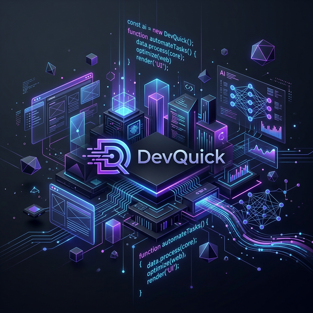

<div align="center">
  
  
  
  <br/>
  
  <a href="https://github.com/red1-for-hek">
    
  </a>
  &nbsp;
  <a href="https://github.com/red1-for-hek?tab=repositories">
    
  </a>
  &nbsp;
  <a href="https://github.com/red1-for-hek?tab=followers">
    
  </a>
  &nbsp;
  <a href="https://github.com/red1-for-hek">
    
  </a>
  
</div>

<br/>

<div align="center">
  
</div>

<br/>


<br/>


<br/><br/>

<table>
<tr>
<td width="55%" valign="top">

### 🎯 What I Do

```yaml
name: Thami Baladi
located_in: Morocco 🇲🇦
current_status: Full-Stack & AI Engineer

areas_of_expertise:
  - 🤖 AI & Computer Vision (SaaS)
  - 🌐 Full-Stack Web Development
  - ⚙️ Workflow Automation (n8n, Docker)
  - 🎨 3D Web Tools (Three.js)
  - ⚡ Audio-Visual Engineering

currently_building:
  - Camera-based tracking systems
  - 30-Day n8n Automation Challenge
  - Modular Furniture Configurators

life_philosophy: "Automate the routine, engineer the future."
</td>
<td width="45%" valign="top">
## 🚀 Current Focus

** 🔍 Developing AI-driven tracking SaaS solutions.**

** ⚡ Mastering n8n automation and Docker workflows.**

** ⚛️ Building robust Full-Stack apps (React/Node.js).**

** 🛠️ Refining 3D customization with Three.js.**

** 📺 Integrating AV technology with modern software.**

##💡 Quick Facts

** 🛠️ 6+ years in professional AV environments.**

** 🚀 Passionate about building in public on GitHub.**

** ☁️ Specialized in scalable cloud-based automation.**

** ☕ Fueled by system architecture and clean code.**

</td>
</tr>
</table>


<div align="center">
<a href="https://github.com/ryo-ma/github-profile-trophy">

</a>
</div>


<div align="center">
<a href="https://github.com/red1-for-hek">

</a>
&nbsp;
<a href="https://github.com/red1-for-hek">

</a>


<a href="https://github.com/red1-for-hek">

</a>


<a href="https://github.com/red1-for-hek">

</a>


</div>


<div align="center">

<br/>
<sub>👾 Contribution Activity Graph</sub>
</div>


<div align="center">

<h4>💻 Languages</h4>
<p>
<a href="https://www.python.org/" target="_blank"></a>
<a href="https://www.typescriptlang.org/" target="_blank"></a>
<a href="https://developer.mozilla.org/en-US/docs/Web/JavaScript" target="_blank"></a>
<a href="https://isocpp.org/" target="_blank"></a>
<a href="https://www.gnu.org/software/bash/" target="_blank"></a>
</p>

<h4>🤖 AI & Machine Learning</h4>
<p>
<a href="https://opencv.org/" target="_blank"></a>
<a href="https://www.tensorflow.org/" target="_blank"></a>
<a href="https://pytorch.org/" target="_blank"></a>
<a href="https://scikit-learn.org/" target="_blank"></a>
</p>

<h4>🌐 Web Development</h4>
<p>
<a href="https://reactjs.org/" target="_blank"></a>
<a href="https://nextjs.org/" target="_blank"></a>
<a href="https://nodejs.org/" target="_blank"></a>
<a href="https://tailwindcss.com/" target="_blank"></a>
<a href="https://threejs.org/" target="_blank"></a>
</p>

<h4>🔧 Tools & Automation</h4>
<p>
<a href="https://www.docker.com/" target="_blank"></a>
<a href="https://n8n.io/" target="_blank"></a>
<a href="https://git-scm.com/" target="_blank"></a>
<a href="https://linux.org/" target="_blank"></a>
<a href="https://www.postman.com/" target="_blank"></a>
</p>

</div>


<div align="center">

⚡ Active Projects
<a href="#">

</a>
&nbsp;
<a href="#">

</a>
&nbsp;
<a href="#">

</a>

</div>


<div align="center">

<a href="https://github.com/red1-for-hek" target="_blank">

</a>
&nbsp;
<a href="https://linkedin.com/in/red1-for-hek" target="_blank">

</a>
&nbsp;
<a href="mailto:redoyanul1234@gmail.com">

</a>

</div>


<div align="center">

💭 Random Dev Quote
<a href="https://github.com/red1-for-hek">

</a>

</div>

<div align="center">


### 🚀 What is DevQuick?
**DevQuick** is a high-performance framework designed to accelerate the development of AI-powered SaaS applications. It bridges the gap between complex backend automation and modern, responsive frontends.

#### 🛠️ Tech Highlights
- **Architecture:** Microservices-based with Docker orchestration.
- **AI Core:** Integrated with OpenAI & Computer Vision (OpenCV) for real-time tracking.
- **Automation:** Powered by custom n8n nodes for complex workflow handling.
- **Frontend:** Next.js 15 with Framer Motion for premium user experiences.

---

<a href="https://buymeacoffee.com/redoyanul1y" target="_blank">

</a>


</div>
Would you like me to generate a **custom project showcase** section to highlight the technical details of your camera-based tracking SaaS?