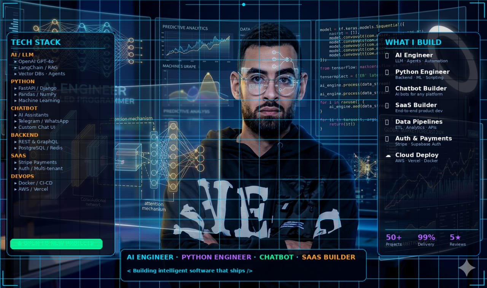

<!-- 
Copyright (c) 2026 Thami Baladi
╔══════════════════════════════════════════════════════════════════════════════╗
║                                                                              ║
║   ██████╗ ███████╗██╗   ██╗ ██████╗ ██╗   ██╗██╗ ██████╗██╗  ██╗             ║
║   ██╔══██╗██╔════╝██║   ██║██╔═══██╗██║   ██║██║██╔════╝██║ ██╔╝             ║
║   ██║  ██║█████╗  ██║   ██║██║   ██║██║   ██║██║██║     █████╔╝              ║
║   ██║  ██║██╔══╝  ╚██╗ ██╔╝██║ ▄ █║██║   ██║██║██║     ██╔═██╗              ║
║   ██████╔╝███████╗ ╚████╔╝ ╚██████╔╝╚██████╔╝██║╚██████╗██║  ██╗             ║
║   ╚═════╝ ╚══════╝  ╚═══╝   ╚═══▀▀╝  ╚═════╝ ╚═╝ ╚═════╝╚═╝  ╚═╝             ║
║                                                                              ║
║              🚀 AI DEVELOPER • FULL-STACK ENGINEER • SAAS BUILDER 🚀         ║
║                                                                              ║
╚══════════════════════════════════════════════════════════════════════════════╝
-->

<div align="center">
  
  <!-- ═══════════════════════════════════════════════════════════════════════════ -->
  <!-- 🎯 ANIMATED HEADER                                                          -->
  <!-- ═══════════════════════════════════════════════════════════════════════════ -->
  
  
  
  <br/>
  
  <!-- ═══════════════════════════════════════════════════════════════════════════ -->
  <!-- 📊 PROFILE BADGES                                                           -->
  <!-- ═══════════════════════════════════════════════════════════════════════════ -->
  
  <a href="https://github.com/ThamiBa">
    
  </a>
  &nbsp;
  <a href="https://github.com/ThamiBa?tab=repositories">
    
  </a>
  &nbsp;
  <a href="https://github.com/ThamiBa?tab=followers">
    
  </a>
  &nbsp;
  <a href="https://github.com/ThamiBa">
    
  </a>
  
</div>

<br/>

<!-- ═══════════════════════════════════════════════════════════════════════════ -->
<!-- 🖥️ TERMINAL INTRO SECTION                                                   -->
<!-- ═══════════════════════════════════════════════════════════════════════════ -->

<p align="left"></p>

<!-- ═══════════════════════════════════════════════════════════════════════════ -->
<!-- 👤 ABOUT ME SECTION                                                          -->
<!-- ═══════════════════════════════════════════════════════════════════════════ -->


<br/><br/>

<table>
<tr>
<td width="55%" valign="top">

### 🎯 What I Do

```yaml
name: Thami Baladi
located_in: Morocco 🇲🇦
current_status: Full-Stack & AI Engineer

areas_of_expertise:
  - 🤖 AI & Computer Vision (SaaS)
  - 🌐 Full-Stack Web Development
  - ⚙️ Workflow Automation (n8n, Docker)
  - 🎨 3D Web Tools (Three.js)
  - ⚡ Audio-Visual Engineering

currently_building:
  - Camera-based tracking systems
  - 30-Day n8n Automation Challenge
  - Modular Furniture Configurators

life_philosophy: "Automate the routine, engineer the future."
```

</td>
<td width="45%" valign="top">

### 🚀 Current Focus

- � **Developing** AI-driven tracking SaaS
- 🤖 **Building** intelligent computer vision systems
- 🧠 **Mastering** n8n automation & Docker workflows
- ⚛️ **Crafting** robust Full-Stack apps (Next.js)
- 🛠️ **Refining** 3D customization with Three.js
- 📺 **Integrating** AV technology with modern software

<br/>

### 💡 Quick Facts

- 🎓 6+ years in professional AV environments
- � Passionate about building in public
- 🌱 Specialized in scalable cloud automation
- ☕ Fueled by system architecture & clean code

</td>
</tr>
</table>

<br/>


<br/>

<!-- ═══════════════════════════════════════════════════════════════════════════ -->
<!-- 🏆 ACHIEVEMENTS SECTION                                                     -->
<!-- ═══════════════════════════════════════════════════════════════════════════ -->


<br/><br/>

<div align="center">
  
  <!-- GitHub Trophies -->
  <a href="https://github.com/ryo-ma/github-profile-trophy">
    
  </a>
  
</div>

<br/>


<br/>

<!-- ═══════════════════════════════════════════════════════════════════════════ -->
<!-- 📊 GITHUB ANALYTICS                                                         -->
<!-- ═══════════════════════════════════════════════════════════════════════════ -->


<br/><br/>

<div align="center">
  
  <!-- GitHub Stats + Custom Streak in ONE ROW -->
  <a href="https://github.com/ThamiBa">
    
  </a>
  &nbsp;
  <a href="https://github.com/ThamiBa">
    
  </a>
  
  <br/><br/>
  
  <!-- 📊 REAL-TIME LANGUAGE USAGE WITH PROGRESS BARS -->
  <a href="https://github.com/ThamiBa">
    
  </a>
  <br/><br/>
  <!-- Activity Graph -->
  <a href="https://github.com/ThamiBa">
    
  </a>
  <!-- Additional Stats Cards -->
    
  
</div>

<br/>


<br/>

<!-- ═══════════════════════════════════════════════════════════════════════════ -->
<!-- 🎮 CONTRIBUTION SHOWCASE                                                    -->
<!-- ═══════════════════════════════════════════════════════════════════════════ -->


<br/><br/>
<div align="center">
  <picture>
      <source media="(prefers-color-scheme: dark)" srcset="./assets/pacman-contribution-graph-dark.svg"/>
      <source media="(prefers-color-scheme: light)" srcset="./assets/pacman-contribution-graph.svg"/>
      
    </picture>
    <br/>
  <br/>
  <sub>👾 Real-time development velocity tracking</sub>
</div>
<br/>


<br/>

<!-- ═══════════════════════════════════════════════════════════════════════════ -->
<!-- ⚡ TECH STACK                                                               -->
<!-- ═══════════════════════════════════════════════════════════════════════════ -->


<br/><br/>

<div align="center">

<!-- 💻 LANGUAGES -->
<h4>💻 Languages</h4>
<p>
  <a href="https://skillicons.dev" target="_blank"></a>
  <a href="https://skillicons.dev" target="_blank"></a>
  <a href="https://skillicons.dev" target="_blank"></a>
  <a href="https://skillicons.dev" target="_blank"></a>
  <a href="https://skillicons.dev" target="_blank"></a>
  <a href="https://skillicons.dev" target="_blank"></a>
  <a href="https://skillicons.dev" target="_blank"></a>
  <a href="https://skillicons.dev" target="_blank"></a>
  <a href="https://skillicons.dev" target="_blank"></a>
  <a href="https://skillicons.dev" target="_blank"></a>
  <a href="https://skillicons.dev" target="_blank"></a>
  <a href="https://skillicons.dev" target="_blank"></a>
  <a href="https://skillicons.dev" target="_blank"></a>
</p>

<!-- 🤖 AI & MACHINE LEARNING -->
<h4>🤖 AI & Machine Learning</h4>
<p>
  <a href="https://opencv.org/" target="_blank"></a>
  <a href="https://www.tensorflow.org/" target="_blank"></a>
  <a href="https://pytorch.org/" target="_blank"></a>
  <a href="https://scikit-learn.org/" target="_blank"></a>
  <a href="https://github.com/ultralytics/ultralytics" target="_blank"></a>
</p>

<!-- 🌐 WEB DEVELOPMENT -->
<h4>🌐 Web Development</h4>
<p>
  <a href="https://reactjs.org/" target="_blank"></a>
  <a href="https://nextjs.org/" target="_blank"></a>
  <a href="https://nodejs.org/" target="_blank"></a>
  <a href="https://expressjs.com/" target="_blank"></a>
  <a href="https://vitejs.dev/" target="_blank"></a>
  <a href="https://tailwindcss.com/" target="_blank"></a>
  <a href="https://threejs.org/" target="_blank"></a>
</p>

<!-- 🗄️ DATABASES -->
<h4>🗄️ Databases</h4>
<p>
  <a href="https://www.mongodb.com/" target="_blank"></a>
  <a href="https://www.sqlite.org/" target="_blank"></a>
  <a href="https://www.postgresql.org/" target="_blank"></a>
</p>

<!-- 🔧 TOOLS & PLATFORMS -->
<h4>🔧 Tools & Platforms</h4>
<p>
  <a href="https://git-scm.com/" target="_blank"></a>
  <a href="https://www.docker.com/" target="_blank"></a>
  <a href="https://n8n.io/" target="_blank"></a>
  <a href="https://www.linux.org/" target="_blank"></a>
  <a href="https://www.postman.com/" target="_blank"></a>
  <a href="https://core.telegram.org/bots" target="_blank"></a>
</p>

</div>

<br/>


<br/>

<!-- ═══════════════════════════════════════════════════════════════════════════ -->
<!-- 🔥 CURRENTLY WORKING ON                                                     -->
<!-- ═══════════════════════════════════════════════════════════════════════════ -->

<div align="center">
  
### ⚡ Featured Project: DevQuick

<br/>

<a href="#">
  
</a>
&nbsp;
<a href="#">
  
</a>
&nbsp;
<a href="#">
  
</a>

</div>

<br/>


<br/>

<!-- ═══════════════════════════════════════════════════════════════════════════ -->
<!-- 🌐 CONNECT WITH ME                                                          -->
<!-- ═══════════════════════════════════════════════════════════════════════════ -->


<br/><br/>

<div align="center">
  
<a href="https://github.com/ThamiBa" target="_blank">
  
</a>
&nbsp;
<a href="https://linkedin.com/in/ThamiBa" target="_blank">
  
</a>
&nbsp;
<a href="https://twitter.com/ThamiBaladi" target="_blank">
  
</a>
&nbsp;
<a href="https://instagram.com/ThamiBaladi" target="_blank">
  
</a>
&nbsp;
<a href="https://facebook.com/ThamiBaladi" target="_blank">
  
</a>
&nbsp;
<a href="https://wa.me/212667579325" target="_blank">
  
</a>
&nbsp;
<a href="mailto:auton8nhub@gmail.com">
  
</a>

</div>

<br/>


<br/>

<!-- ═══════════════════════════════════════════════════════════════════════════ -->
<!-- 💡 RANDOM DEV QUOTE                                                         -->
<!-- ═══════════════════════════════════════════════════════════════════════════ -->

<div align="center">
  
### 💭 Random Dev Quote

<br/>

<a href="https://github.com/ThamiBa">
  
</a>

</div>

<br/>

<!-- ═══════════════════════════════════════════════════════════════════════════ -->
<!-- 🌟 FOOTER                                                                   -->
<!-- ═══════════════════════════════════════════════════════════════════════════ -->

<div align="center">
  
  
  
  <br/>
  
  <!-- ☕ BUY ME A COFFEE -->
  <a href="https://buymeacoffee.com/redoyanul1y" target="_blank">
    
  </a>
  
  <br/><br/>
  
  
  
</div>

<!-- ═══════════════════════════════════════════════════════════════════════════ -->
<!-- 📝 END OF README                                                            -->
<!-- ═══════════════════════════════════════════════════════════════════════════ -->